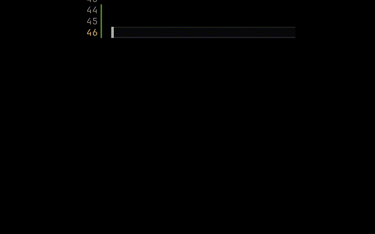

<p align="center">
    
</p>

<h1 align="center">Markdown Snippets</h1>

<p align="center">
  <a href="https://github.com/Amereyeu/Markdown-snippets">
    
  </a>
  <a href="https://open-vsx.org/extension/Amerey/markdown-snippets">
    
  </a>
  <a href="https://open-vsx.org/extension/Amerey/markdown-snippets">
    
  </a>
  <a href="https://github.com/Amereyeu/Markdown-snippets/issues">
    
  </a>
  <a href="https://ko-fi.com/amerey">
    
  </a>
</p>

## Snippets

|            Snippet | Description                 |
| -----------------: | :-------------------------- |
|   md-alert-caution | Markdown Alert Caution      |
| md-alert-important | Markdown Alert Important    |
|      md-alert-note | Markdown Alert Note         |
|       md-alert-tip | Markdown Alert Tip          |
|   md-alert-warning | Markdown Alert Warning      |
|      md-code-block | Markdown Block Code         |
|        md-bloquote | Markdown Bloquote           |
|     md-code-inline | Markdown Inline Code        |
| md-bloquote-nested | Markdown Nested Bloquote    |
|            md-bold | Markdown Bold Text          |
|     md-bold-italic | Markdown Bold Italic Text   |
|         md-comment | Markdown Comment            |
|           md-emoji | Markdown Emoji              |
|        md-footnote | Markdown Footnote           |
|       md-heading-1 | Markdown Heading 1          |
|       md-heading-2 | Markdown Heading 2          |
|       md-heading-3 | Markdown Heading 3          |
|       md-heading-4 | Markdown Heading 4          |
|       md-heading-5 | Markdown Heading 5          |
|       md-heading-6 | Markdown Heading 6          |
| md-horizontal-rule | Markdown Horizontal Rule    |
|           md-image | Markdown Image              |
|          md-italic | Markdown Italic Text        |
|            md-link | Markdown Link               |
|      md-math-block | Markdown Math Block         |
|     md-math-inline | Markdown Math Inline        |
|         md-mention | Markdown Mention            |
|    md-ordered-list | Markdown Ordered List       |
|      md-page-break | Markdown Page Break         |
|   md-strikethrough | Markdown Strikethrough Text |
|       md-task-list | Markdown Task List          |
|    md-table-header | Markdown Table Header       |
|       md-table-row | Markdown Table Row          |
|  md-unordered-list | Markdown Unordered List     |

## Usage

Snippets are only active in Markdown files. If they do not show up edit your `settings.json` file and add following code:

```
  "[markdown]": {
    "editor.quickSuggestions": {
      "other": true,
      "comments": false,
      "strings": false
    }
  }
```


